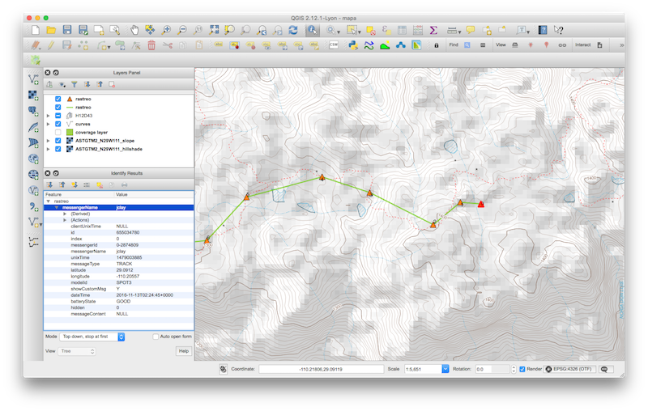

# SpotPipe
Real time Piping tool for SPOT feeds

Translates a [SPOT feed](https://faq.findmespot.com/index.php?action=showEntry&data=69) into [GeoJSON format](http://www.geojson.org/geojson-spec.html).

## Dependencies
Dependencies are managed by Composer.
To install dependencies run:
```
$ composer install
```

## API
GET parameters:

 - `feed`: *required*, feed id of a Shared Page (see [http://www.findmespot.com/en/index.php?cid=111](http://www.findmespot.com/en/index.php?cid=111))
 - `password`: *optional*, if the feed is private then omitting this parameter will return an error
 - `linestring`: *optional*, set to 1 in order to return a lineString instead of Points
 - `all`: *optional*, set tp 1 in order to return not only the last 50 messages but all of them
 
 Example:
 http://your.domain.com/SpotPipe/index.php?feed=yourFeedKeyHere
 
## Usage example in QGIS


How to integrate a live feed in QGIS: [http://www.fulcrumapp.com/blog/live-data-visualization-in-qgis/](http://www.fulcrumapp.com/blog/live-data-visualization-in-qgis/)

## Todo
                          
  * Local caching of feed and check against feed's last message date
  * Continuous Integration