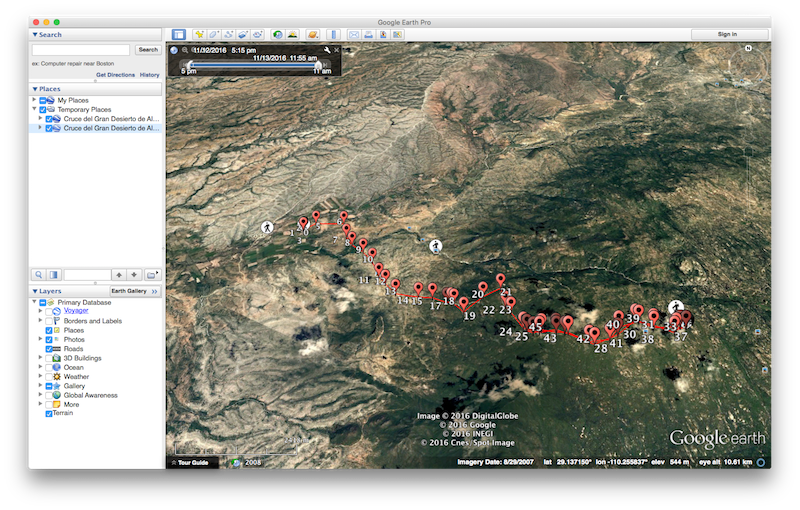
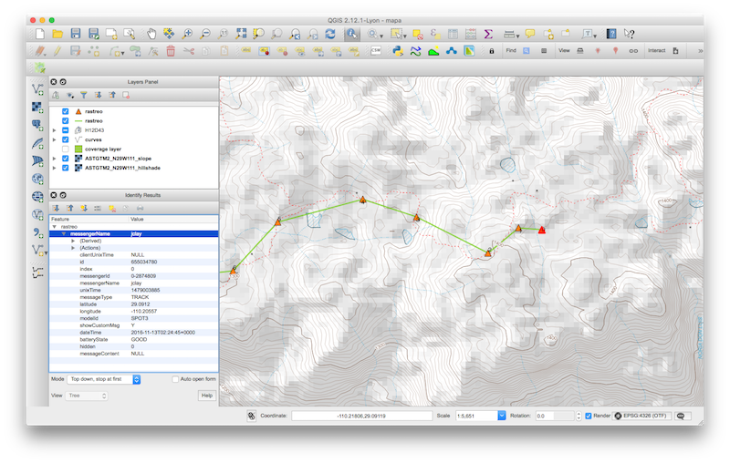

# SpotPipe
Real time Piping tool for SPOT feeds

Translates a [SPOT feed](https://faq.findmespot.com/index.php?action=showEntry&data=69) into [GeoJSON format](http://www.geojson.org/geojson-spec.html).

## Dependencies
Dependencies are managed by Composer.
To install dependencies run:
```
$ composer install
```

## API
GET parameters:

 - `client`: *required*, client name, can be one of [*spot*]
 - `from`: *required*, source feed format, can be one of [*json*]
 - `to`: *required*, target feed format, can be one of [*geojson*, *kml*] 
 - `feature`: *optional*, feature type, can be one of [*point*, *linestring*, *both*], default *point*. *both* is available only for *kml* target format.
 
When using client *spot*:

 - `feed`: *required*, feed id of a Shared Page (see [http://www.findmespot.com/en/index.php?cid=111](http://www.findmespot.com/en/index.php?cid=111))
 - `password`: *optional*, if the feed is private then omitting this parameter will return an error
 - `all`: *optional*, set to 1 in order to return not only the last 50 messages but all of them
 
 Example:
 http://your.domain.com/SpotPipe/index.php?client=spot&from=json&to=geojson&feature=linestring&feed=yourFeedKeyHere&password=feedsPassword
 
## Usage example in Google Earth:


## Usage example in QGIS:


How to integrate a live feed in QGIS: [http://www.fulcrumapp.com/blog/live-data-visualization-in-qgis/](http://www.fulcrumapp.com/blog/live-data-visualization-in-qgis/)

## Todo
                          
  * Continuous Integration